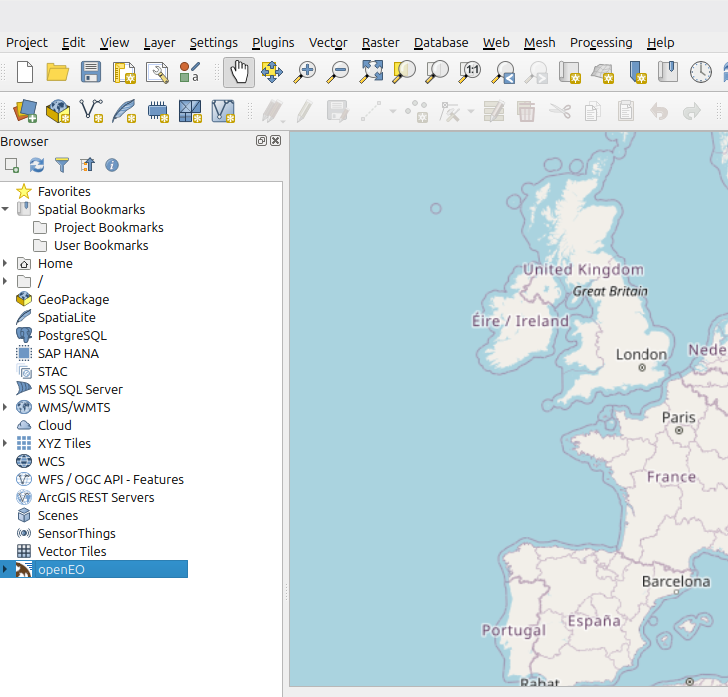
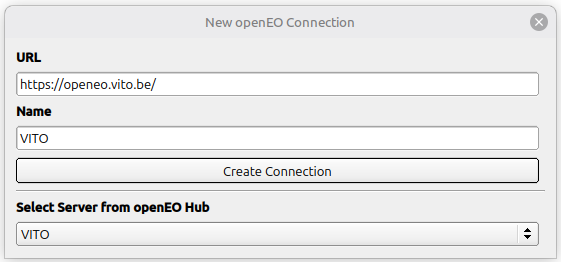
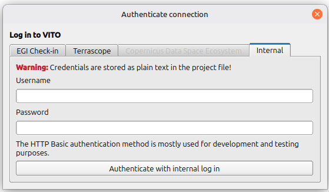
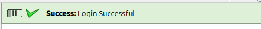
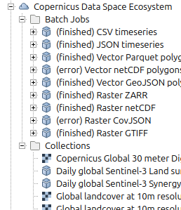
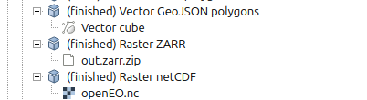

# QGIS Plugin

The openEO QGIS plugin enables exploring openEO backends including batch jobs, collections, and web services within QGIS. The plugin can load the results of a job execution or web service to the QGIS map, so that the user can make further analyses and visualisation steps. Furthermore the plugin allows for display of collections, provided they are served as XYZ or WMTS tile map services.

## Installation
 
For installation, the **latest stable version** is accessible in the plugin 
manager of QGIS (`"Plugins"` -> `"Manage and Install Plugins"`). You can search for "OpenEO" in the plugin manager, then install and activate the plugin.

This tutorial shows the capabilities of version 2.0. Make sure you have installed at least that version.

After a successful installation and activation of the plugin, an openEO entry will be visible in the QGIS browser:

This is where all the functionality of the plugin in accessible.

Instructions on additional installation methods can be found in the [QGIS Plugin Repository Readme](https://github.com/Open-EO/openeo-qgis-plugin?tab=readme-ov-file#install)

## Connection

To connect to an openEO backend of your choice, right-click the openEO browser entry and select `"New openEO Connection"`.

This will open a dialog window that allows you to enter URL and name of your new openEO connection or select a connection from [openEO Hub](https://hub.openeo.org/):

Now that you have chosen a backend, a login-dialog may open. you can also access this dialog by expanding the openEO browser item and right-clicking on the connection entry to select `"Log In (Authenticate)"`. 

The login-dialog will allow you to use Basic authentication or [OpenID Connect](https://openid.net/connect/) authentication to login your connection:

Using OpenID Connect login will open a window of your system's web browser, where you are asked to authenticate your connection. After authentication, you can return to your qgis window. On successful authentication, QGIS will display a success banner indicating a successful login: 

If logged in successfully, next to `"Collections"`, it is now possible to expand the `"Batch Job"` and `"Web Services"` entry that can be found upon expanding your connection browser item (provided the given backend supports each).

### Logging out

**IMPORTANT:** Basic login information and OpenID Connect tokens are stored in plain text within the settings of your QGIS profile. On shared computers it is advised to log out of or remove connections after your work is done in order to delete authentication information:

- `Right-click on connection` -> `"Remove Connection"` or `"Log out"`

To remove all stored information on your connections:

- `Right-click on openEO icon` -> `"Remove all connections"` or `"Logout from all connections"`

## Exploring a backend
Upon connection to a backend, a list of all Collections provided by this backend is available. After authenticating this backend, lists for Batch jobs and Web Services that have been created by your user account are available (as long as the backend supports the use of batch jobs or web services).

A Detail-view of your connection can be accessed via `Right-click` -> `"Details"`. This will open a web-browser that displays information on your chosen backend.
To view your connection in the openEO Web Editor, you can use `Right-click` -> `"Open in Web Editor"`. This will open a web-browser in which you can log in and configure and edit Web Services or Batch Jobs.

### Collections
Expanding the **Collections** sub-item will yield a list of all collections that are offered by your openEO backend. 
using `Right-click` -> `"Details"` will open a web-browser window that displays further information on your selected collection.
Collections that have a tile-map-service available as a preview are displayed with a Raster-layer icon as opposed to the default cube icon. These Collections can be added as tile-map layers to your project by using either by `Right-click` -> `"Add Layer to Project"` or by dragging the item from your QGIS browser into your QGIS map.

### Web Services
Expanding the Web Services sub-item will yield a list of all Web-Services that are accessible by the user-account that was used for authentication. 
Using `Right-click` -> `"Details"` on a Web-Service-item will open a web-browser window that displays further information on your selected Service.
Provided the Web-Service is enabled, you can add it to your QGIS project by using either by `Right-click` -> `"Add Layer to Project"` or by dragging the item from your QGIS browser into your QGIS map.
Note that the display of your Web-Service within your QGIS project will depend on the configuration of said web-service. 

### Batch Jobs
Expanding the Batch Jobs sub-item will yield a list of all Web-Services that are accessible by the user-account that was used for authentication. 
Using `Right-click` -> `"Details"` on a Batch-Job-item will open a web-browser window that displays further information on your selected Service.
To view the logs of your Batch Job, `Right-click` -> `"View Logs"`. This will open a web-browser window that displays the logs of the batch job. 

**Note**: the logs displayed here represent a snapshot of the logs at the time of retrieval. To view updated logs, use `Right-click` -> `"View Logs"` once more.

#### Result Items
The Batch Job items can be expanded and contain sub-Items that represent the Results of the batch jobs, if available.
Result items can be either downloaded via `Right-click on the result item`, or downloaded in batch by `Right-click on the containing job` -> `"Download Results To.."` -> `Select download directory`. By default, Results are saved to your systems download folder within your user directory.

Certain Result items can be added to your QGIS project as layers. These carry either a raster-icon (see example screenshot: `"Raster netcdf"`) or a vector-icon  (see example screenshot: `"Vector GeoJSON polygons"`), depending on the type of available layer. Result files that can not be added to your project carry a regular file-icon (see example screenshot: `"Raster-ZARR"`).

You can add these to your QGIS project by using either by `Right-click` -> `"Add Layer to Project"` or by dragging the item from your QGIS browser into your QGIS map. Additionally you can bulk-add your Job Results to your project by selecting `Right-click` -> `"Add Results to Project"` on the containing Batch-Job Item.

## Additional Information

* [Github Repository](https://github.com/Open-EO/openeo-qgis-plugin)
* [QGIS Plugin Page](https://plugins.qgis.org/plugins/openeo_plugin/)